# Hex Color Guessing Game

Welcome to the Hex Color Guessing Game! This is a fun and interactive game where you guess the correct hex color based on the given color code. It's a great way to test and improve your color recognition skills. Suitable for all ages!

Can you guess the right color from its hex code? Click [HERE](https://ts2017185.github.io/hex-color-guessing-game/index.html) to challenge yourself and see how high you can score!

Enjoy the game and happy guessing!

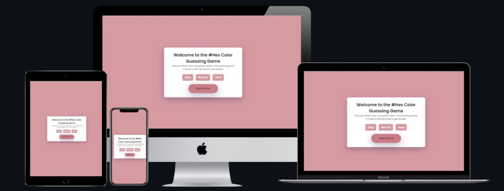

## Contents
* [**User Experience UX**](<#user-experience-ux>)
    * [User Stories](<#user-stories>)
    * [Wireframes](<#wireframes>)
    * [Site Structure](<#site-structure>)
    * [Design Choices](<#design-choices>)
        *  [Typography](<#typography>)
        *  [Colour Scheme](<#color-scheme>)
* [**Features**](<#features>)
    * [**Existing Features**](<#existing-features>)
        * [Home Page](<#home-page>)
        * [Game Interface](<#game-interface>)
        * [Difficulty buttons](<#difficulty-buttons>)
        * [Timer](<#timer>)
        * [Next Button](<#next-button>)
        * [End of Game Screen](<#end-of-game-screen>)
    * [**Future Features**](<#future-features>)
* [**Technologies Used**](<#technologies-used>)
* [**Testing**](<#testing>)
* [**Deployment**](<#deployment>)
* [**Credits**](<#credits>)
    * [**Content**](<#content>)
    * [**Media**](<#media>)
*  [**Acknowledgements**](<#acknowledgements>)

## User Experience (UX)

### User Stories

- As a user, I want to know how to play the game.
- As a user, I want to see my score at the end of the game.
- As a user, I want to know how much time I have left to guess a color.
- As a user, I want to know when I have completed the game.
- As a user, I want to reset the game for another attempt.
- As a user, I want to choose the difficulty level to match my skills.
- As a user, I want to return to home screen and change the difficulty if necessary.

### Wireframes

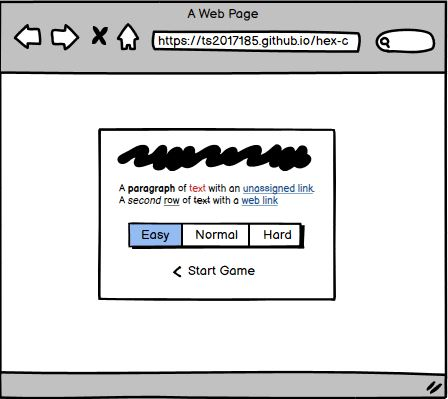
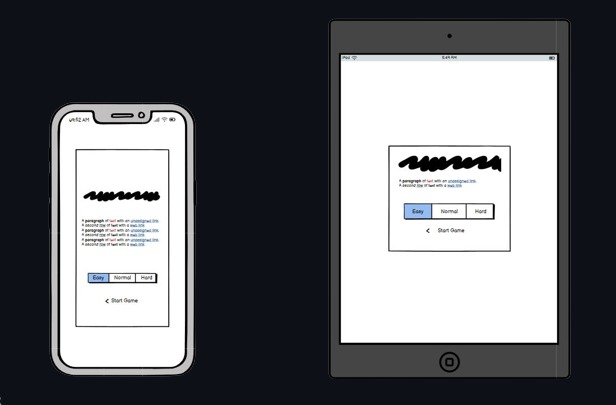

### Site Structure

The Hex Color Guessing Game is designed to be simple and intuitive. It consists of one main page with the game interface. The Home page explains how to play, allows users to chose the dificulty, and start the game. The game interface displays the hex color to guess, the timer, and the score after the user finish the 5 rounds. The end-of-game screen shows the final score and gives options to restart the game or return to home page and change the dificulty.

### Design Choices

#### Typography

- The main heading uses a bold and eye-catching font to grab attention.
- The text uses a clean "Poppins", sans-serif font for easy readability.

#### Color Scheme

- Bright and vibrant colors are used to make the game engaging and fun.
- The background color is soft to avoid distracting from the main game content.

 Here are the colour palattes used on this project:

 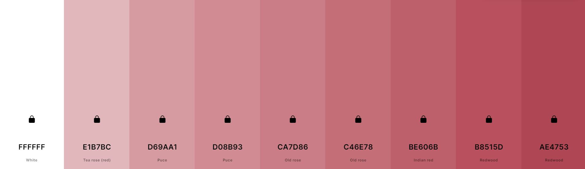

[Back to top](<#contents>)

## Features

### Existing Features

#### Home Page

- Provides an introduction to the game and explains the rules.
- Features a "Start" button to begin the game.

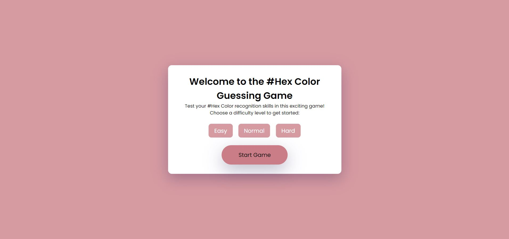

#### Game Interface

- Displays a random hex color code for the user to guess.
- Shows options for the user to select the correct color.

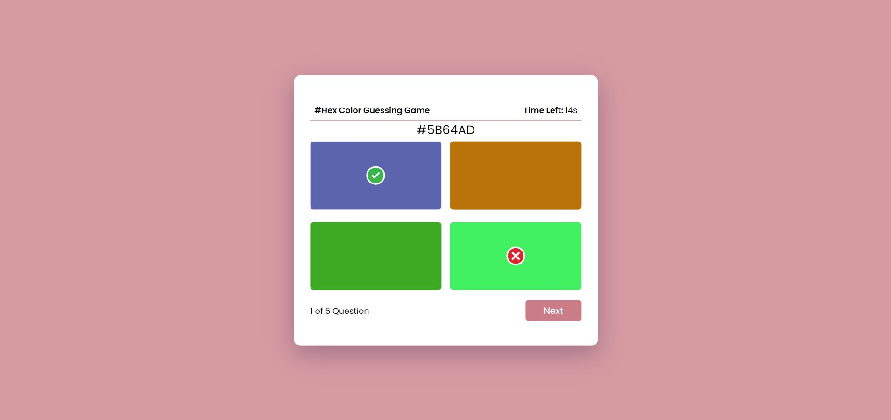

#### Difficulty buttons

#### Timer

- The score panel shows the number of correct guesses.
- The timer tracks the time taken to make guesses and changes color after set intervals to indicate elapsed time.

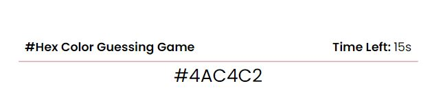
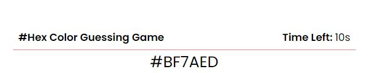
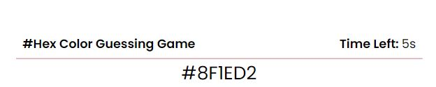

#### Next Button

- Allows users to proceed to the next color after making a guess.

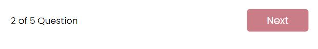

#### End of Game Screen

- Displays the user's final score and time taken.
- Provides buttons to restart the game or return to the main screen.

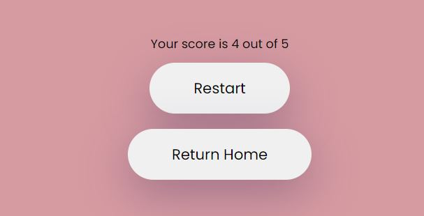

### Future Features

- A high score board to track top scores over multiple sessions.
- Increase the number of colors displayed on game and new game modes.

## Technologies Used

- **HTML5**: For structuring the content.
- **CSS3**: For styling the game.
- **JavaScript**: For game logic and interactivity.
- **GitHub Pages**: For deploying the game online.

## Testing

For detailed information on testing the Hex Color Guessing Game, please refer to the [TESTING.md](TESTING.md) file.

[Back to top](<#contents>)

## Deployment

__Deployment to GitHub Pages__

The live link can be found here - https://ts2017185.github.io/hex-color-guessing-game/ 

Deploying the Castle Tours website to GitHub Pages involves several steps. GitHub Pages is a static site hosting service designed to host your personal, organization, or project pages directly from a GitHub repository.

__Steps to Deploy__

1. Create a GitHub Repository:

    - Go to GitHub and log in to your account.
    - Click the "+" icon in the top right corner and select "New repository."
    - Name your repository (e.g., castletours), add a description, and choose whether it will be public or private.
    - Initialize the repository with a README file.

2. Clone the Repository:

    - Open your terminal or command prompt.
    - Clone the repository to your local machine using the following command:
    ```
    git clone https://github.com/your-username/hex-color-guessing-game.git
    ```
    Replace '__your-username__' with your GitHub username.

3. Add Project Files:

    - Copy all the project files (HTML, CSS, JavaScript, images, etc.) into the cloned repository directory.
    - Ensure your '__index.html__' file is in the root directory of the repository, as GitHub Pages uses this file as the entry point for the site.

4. Commit and Push Changes:

    - Navigate to the repository directory in your terminal or command prompt.
    Add all the files to the staging area using:
    ```
    git add .
    ```
    - Commit the changes with a descriptive message:
    ```
    git commit -m "Initial commit with project files"
    ```
    - Push the changes to GitHub:
    ```
    git push origin main
    ```
    - Note: If your default branch is '__master__', replace '__main__' with '__master__'.

5. Enable GitHub Pages:

    - Go to your repository on GitHub.
    - Click on "Settings" in the repository menu.
    - Scroll down to the "GitHub Pages" section.
    - Under "Source," select the branch you want to deploy from (e.g., '__main__' or '__master__').
    - Click "Save."

6. Access Your Website:

    - After enabling GitHub Pages, you will see a URL where your site is hosted. It will be in the format:
    ```
    https://your-username.github.io/hex-color-guessing-game/
    ```
    Visit this URL to see your live site.

__Continuous Deployment__

- Commit and Push Changes: Whenever you make updates to your project, commit and push the changes to the same branch you have configured for GitHub Pages.

- Automatic Updates: GitHub Pages will automatically rebuild and update your site with the latest changes.

[Back to top](<#contents>)

## Credits

### Content

- Fonts were imported from [Google Fonts](https://fonts.google.com/).
- Color palette idead came from [Coolors]([http://colormind.io/](https://coolors.co/)).
- Game idea came from Andrew Yang and his project [What the Hex?](https://yizzle.com/whatthehex/?n=7).
- I used some YouTube videos and tutorials as a foundation and resource for this project. Notable contributors include [FreeCodeCamp.org](https://www.youtube.com/@freecodecamp), and [Coding Artist](https://www.youtube.com/@CodingArtist).

### Media

- The Favicon came from [favicon.io](https://favicon.io/favicon-generator/).

## Acknowledgements

The site was created as Portfolio Project 2 for the Full Stack Software Developer (e-Commerce) Diploma at the Code Institute. 

This project was inspired by the desire to create a fun and educational game for all ages, especially for those who want to become more familiar with hex colors. 

Special thanks to all the contributors and the open-source community for their valuable resources.

[Back to top](<#contents>)
