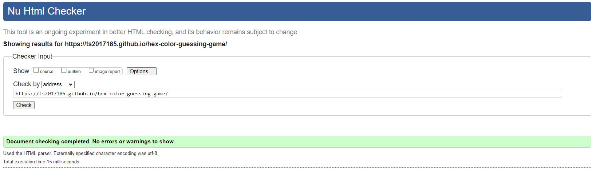
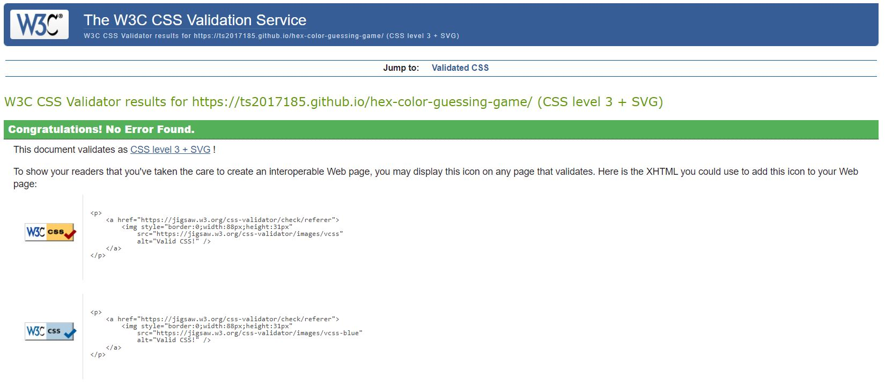
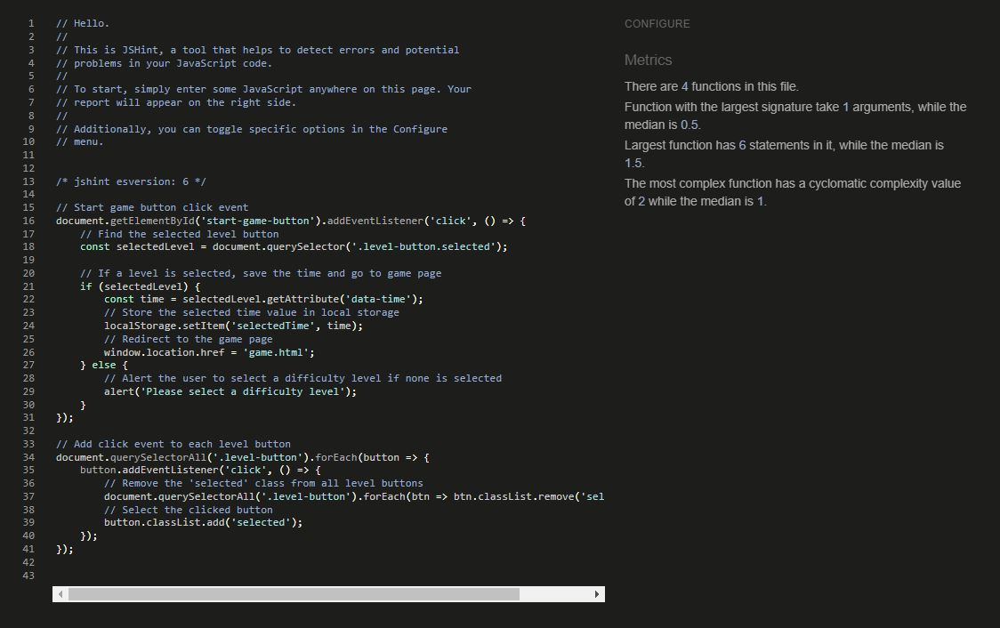

# Testing
## Code Validation

Hex Color Guessing Game has be throughly tested. All the code has been run through the [W3C html validator](https://validator.w3.org/), the [W3C CSS validator](https://jigsaw.w3.org/css-validator/)
and the [JavaScript JSHint validator](https://jshint.com/). 

The code passed all of the validators once minor points had been corrected.

The HTML validator results are below:

The CSS validator results are below:

The JSHint validator results showed that there were a number of minor errors such as the 'esversion' option cannot be set after any executable code. 
These errors were corrected and subsequent passes through JSHint revealed no major flaws.

## Responsiveness Test

The responsive design tests were carried out manually with [Google Chrome DevTools](https://developer.chrome.com/docs/devtools/) and [Responsive Design Checker](https://www.responsivedesignchecker.com/).

|        | GoogleP | Nexus 4   | iPhone 7 | iPad | iPad Pro | Display <1200px | Display >1200px |
|--------|---------|-----------|----------|------|----------|-----------------|-----------------|
| Render | pass    | pass      | pass     | pass | pass     | pass            | pass            |
| Images | pass    | pass      | pass     | pass | pass     | pass            | pass            |
| Links  | pass    | pass      | pass     | pass | pass     | pass            | pass            |

## Browser Compatibility

Hex Color Guessing Game was tested on the following browsers with no visible issues for the user. 
Google Chrome, Microsoft Edge, and Mozilla Firefox. Appearance, functionality and responsiveness were consistent throughout for a range of device sizes and browsers.

## Testing User Stories

* As a user, I want to know how to play the game.
    * On the **Home Page** there is a description of the game and how to play. Also, the game is user-friendly and intuitive.
    
     
* As a user, I want to see my score at the end of the game.
    * Once the game is completed the **End Game** pop-up displays the result.
    
     
* As a user, I want to know how much time I have left to guess a color.
    * There is a **Timer** visible.
    
     
* As a user, I want to know when I have completed the game.
    * Once all the rounds are over, a display message will appear.
    
     
* As a user, I want to reset the game for another attempt.
    * Once the game is completed, you can click on **Restart**, and initiate a new game.
    
     
* As a user I want to choose the difficulty level to match my skills.
    * The level of challenged in this game is determined by level selected on the Home Page. 
    * Easy = 15s, Normal = 10s, Hard = 5s.

* As a user, I want to return to home screen and change the difficulty to match my skills.
    * This can be changed returning to the **Home Page**.  

## Known Bugs

* ### Resolved
  
    * The timer can take a little bit longer to appears.
    * the svg images do not show up sometimes.

## Additional Testing

### Lighthouse

The site was also tested using [Google Lighthouse](https://developers.google.com/web/tools/lighthouse) in Chrome Developer Tools to test each of the pages for:
* Performance - How the page performs whilst loading.
* Accessibility - Is the site acccessible for all users and how can it be improved.
* Best Practices - Site conforms to industry best practices.
* SEO - Search engine optimisation. Is the site optimised for search engine result rankings.

Here are the results from the test. 

Back to [README.md](./README.md#testing).
